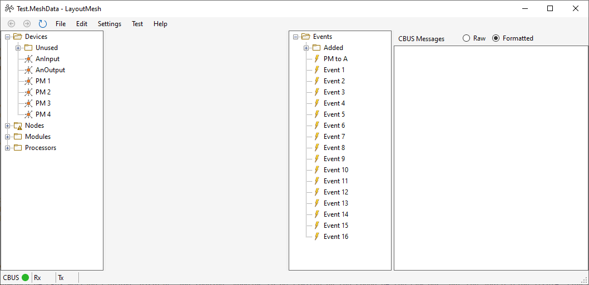
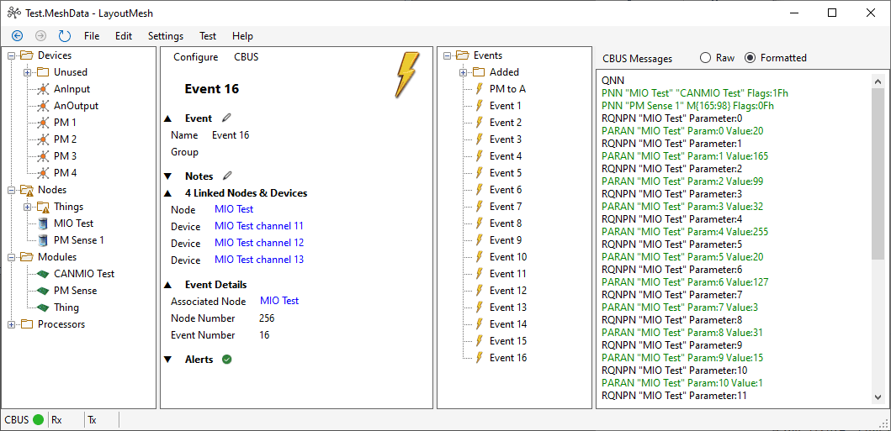
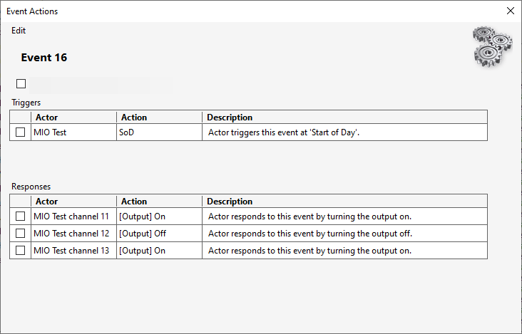
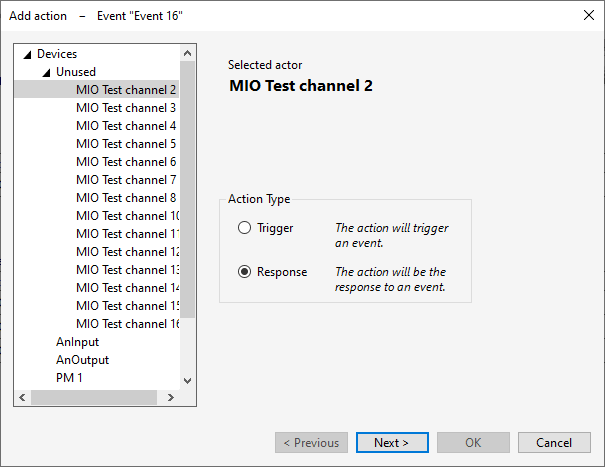
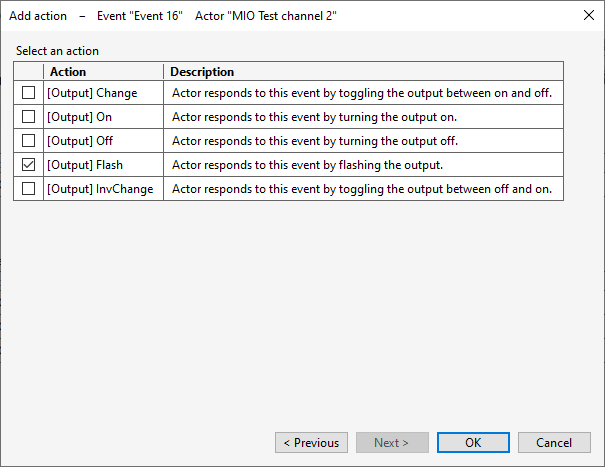
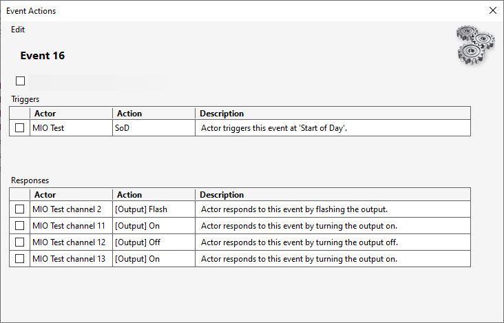
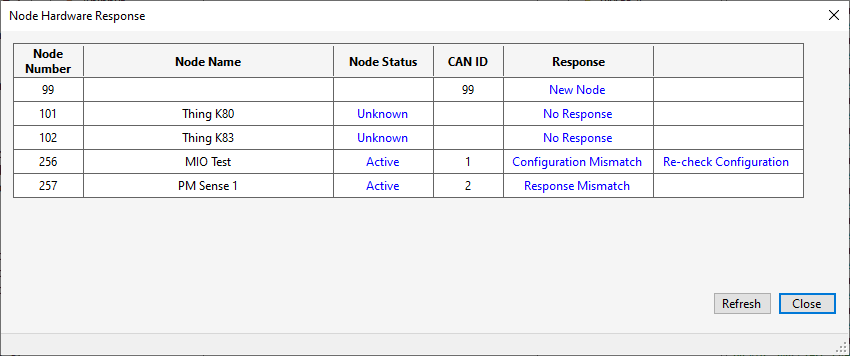

# LayoutMesh
A CBUS module configuration utility for model railway layouts.

## Design

### Vision
**To create a consistent and coherent CBUS layout configuration utility that can be used with the minimum of background knowledge by layout builders, whilst also being a powerful tool for module development.**

LayoutMesh is an application which represents a layout as a series of devices (e.g. a switch, a point motor, a signal) and a series of events (e.g. 'Select route A', 'Loco detected in block').  The user creates an event, giving it a name and adding free-text notes if required.  The event is then configured to communicate between devices by configuring trigger and response actions; for example: a switch is assigned to trigger the event, and two point motors are assigned to respond to the event.

For module developers, LayoutMesh provides CBUS message display and logging, manual triggering of events, and firmware uploading. Data files, which contain all device, node, module, processor, and event information, will be human-readable. Data loading will be edit-tolerant, with the ability to handle missing and duplicated data in a predictable manner.

### Design Specifics
* Modules represented by nodes (specific instances of a module), and devices (multi-channel nodes have a device per channel).
* All main entities (devices, nodes, modules, processors & events) may be given a meaningful name, have free-text notes added.  Each entity type has its own hierarchical tree structure, allowing entities to be grouped together however the user wishes.
* Events may have multiple trigger actions and multiple response actions. Trigger and responder devices may be on different nodes, or the same node  (firmware permitting).
* Capture and display of CBUS traffic in real time, including data translation.
* A 'synchronise' display handles hardware or data changes by comparing the hardware and data configuration of nodes, and, if they don't match, allowing the user to choose synchronisation options such as making the hardware match the data, or vice versa.
* Data and hardware configuration backups made before any changes are mode.
* No module-specific code in the main application. Node configuration may be provided for those modules that don't have a self-configuration mechanism, using separately installable 'plug-in' files.
* Simple installation from a .zip file. No hidden directories or files.
* All code and documentation will be made available on GitHub on an open MIT license.

### Target Systems
The application is written in C# for Windows systems, based on .NET Desktop 7.

## Progress
Project started January 2023.

### As of November 2023...

#### Features Complete or Near Completion (subject to testing)
* All core features now coded.

#### In Progress
* Code tidy-up, refactoring, review and commenting.

#### Not Started
* Module-specific node configuration plug-ins.
* Testing. And more testing.
* Documentation.

#### Not Known
* Interaction with SLiM nodes.
* Interaction with DCC nodes.
* There appears to be no documentation for the current FCU's functionality, so there are possibly things in there that I (and probably most people) know nothing about.

### As of July 2023...

#### Features Complete or Near Completion (subject to testing)
* 'MeshData' files - XML file load and save; JavaScript parse and execute.
* Main user interface - entity tree views; central entity information display panel; CBUS message display; drag & drop.
* CBUS interface - COM port; message transmit and receive; formatting of CBUS data; logging.
* Editing entity names, notes, and groups.
* Editing event actions - assigning trigger and response actions; deleting actions.

#### In Progress
* Synchronisation between MeshData and hardware.
* Adding context menus for entity add/edit/delete.

#### Not Started
* Module-specific node configuration plug-ins.
* Firmware upload.
* Testing. And more testing.
* Documentation.

#### Not Known
* Interaction with SLiM nodes.
* Interaction with DCC nodes.
* There appears to be no documentation for the current FCU's functionality, so there are possibly things in there that I (and probably most people) know nothing about.

### Screenshots (July 2023)

User interface: entity treeviews on left and right of central information panel, and CBUS message panel.

  

User interface with event "Event 16" selected: central panel showing data available about the event.

  

Event 'Configure->Actions' shows the Event actions dialog: note level of detail about each action.

  

Actions 'Edit->Add Response' Add action dialog page 1: device "MIO Test channel 2" selected as a response action.

  

Add action dialog page 2: specific action (flash output) selected.

  

Event actions dialog: showing the newly added action.

  

Sync dialog: highlights differences between the application's data (MeshData), and the hardware.  Done by reading a node's parameters, node variables, events, and event variables.  Examples shown in the screenshot are: node 99, which responded on CBUS, but has no MeshData node; nodes 101 and 102 which exist in MeshData, but did not respond on CBUS; nodes 256 and 257 which exist in MeshData and responded. For these last two, a number of checks are performed: the hardware and MeshData module types match (if not, they are two different modules, and shouldn't have the same node number); the parameters match (if not, there is probably a firmware difference), everything else matches (if not, the configurations are out of step). Clicking on the response gives the user options available to 'fix' any mismatch. In the screenshot case, node 256 differs from its hardware in configuration data, and node 257 actually references a different module.

  

### Notes

Looked at JSON as a format for MeshData files; found it difficult to manually read and edit.  Reverted to trusty old XML - tags let you know what you are looking at. By careful association of data model classes with the underlying XML, the application preserves user formatting, comments etc. when saving the XML file.

Pleased with the performance of CBUS message capture, display, and logging. Appears to be limited by the speed of the CAN bus, not the application itself. Certainly a lot faster than the current FCU - for example: FCU takes 4.7 seconds to read 127 node variables from a CANMIO node; LayoutMesh reads the same node variables, and the events, and the event variables, and runs JavaScript to translate the event variables into actions ... all in 0.75 seconds.
