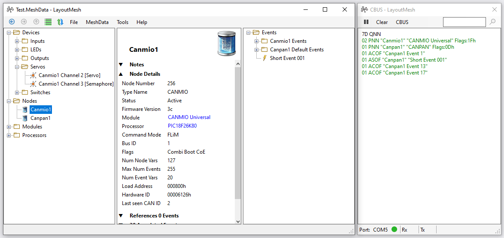

# LayoutMesh
A CBUS module configuration utility for model railway layouts.

 

## Update
The initial version of LayoutMesh has been released: **LayoutMesh 1.0.0-alpha.1**.

Please note that this is a pre-release alpha (preview) version: the application has not yet undergone extensive testing in real-life environments; it may have limited functionality in some areas; features may be modified or removed before the final release.

CANMIO and CANPAN CBUS modules are supported in terms of the data describing events and event actions, and also for module-specific node configuration screens.  Other module types are currently supported with a generic node variable and event variable editor.  Addition of module specific support should not require changes to the main application.

## Design

### Concept
**A consistent and coherent CBUS layout configuration utility that can be used with the minimum of background knowledge by layout builders, whilst also being a powerful tool for module development.**

LayoutMesh is an application which represents a model railway layout as a series of devices (e.g. a switch, a point motor, a signal) and a series of events (e.g. 'Select route A', 'Loco detected in block').  The user creates an event, giving it a name and adding free-text notes if required.  The event is then configured to communicate between devices by defining trigger and response actions; for example: a switch is assigned to trigger the event, and two point motors are assigned to respond to the event.

For module developers, LayoutMesh provides CBUS message display and logging, manual triggering of events, and firmware uploading. Data files, which contain all device, node, module, processor, and event information, are human-readable. Data loading is edit-tolerant, with the ability to handle missing and duplicated data in a predictable manner.

### Design Specifics
* Modules represented by nodes (specific instances of a module), and devices (multi-channel nodes have a device per channel).
* All main entities (devices, nodes, modules, processors & events) may be given a meaningful name, have free-text notes added.  Each entity type has its own hierarchical tree structure, allowing entities to be grouped together however the user wishes.
* Events may have multiple trigger actions and multiple response actions. Trigger and responder devices may be on different nodes, or the same node  (firmware permitting).
* Capture and display of CBUS traffic in real time, including data translation.  The CBUS display is a separate window, allowing it to be positioned and accessed independent of the main application.
* A 'synchronise' display handles hardware or data changes by comparing the hardware and data configuration of nodes, and, if they don't match, allowing the user to choose synchronisation options such as making the hardware match the data, or vice versa.
* Data and hardware configuration information is backed up before any changes are made, and can be restored easily if required.
* No module-specific code in the main application. Node configuration may be provided for those modules that don't have a self-configuration mechanism, using separately installable 'plug-in' files.
* Simple installation from a .zip file. No hidden directories or files.
* All code and documentation will be made available on GitHub under an open MIT license.

### Target Systems
The application is written in C# for Windows systems, based on .NET Desktop 8.0.

## Installation
The application does not have its own installer.  The installation process is simply to download a zip file, and extract its contents to a suitable directory.  Shortcuts to the program may be created on the desktop, the taskbar, or anywhere else that makes sense.

LayoutMesh requires '.NET Desktop Runtime 8.0' to be installed on your computer.  If this is not found when you run the application for the first time, a message box will appear providing a link to download .NET from Microsoft.  Clicking on the 'Download it now' link will download the .NET installer; double-clicking on the installer installs .NET - this is a very quick and simple operation, not requiring a reboot.

By default, LayoutMesh looks for user files (layout data, settings etc.) in subdirectories under 'Documents\LayoutMesh'. This would be a suitable directory for the zip file contents if you envisage only ever running one version of LayoutMesh at a time; if you want side-by-side installations of different versions, then installing each version in its own subdirectory might be more appropriate.  Changing the installation directory at a later date is simply a matter of moving the program and subdirectories, and updating any shortcuts.

* Go to the release page on GitHub: https://github.com/Syspixie/LayoutMesh/releases.
* Click on the release required, e.g. 'v1.0.0'.
* Click on the specific zip file, e.g. 'LayoutMesh-1.0.0-win-x64.zip', to download it (to, for example, your 'Downloads' folder).
* Navigate to the download directory, and double-click the zip file.
* Extract the contents to your chosen directory.
* Navigate to your chosen directory; there should be a LayoutMesh.exe file, plus 'Addins' and 'Config' subdirectories and their files.
* Double-click the LayoutMesh.exe file to run the application.  Install .NET if prompted (a one-off operation).

## Getting Started
There are two ways of getting started with LayoutMesh:
1. Importing data from the MERG FlimConfig utility (FCU).
1. Connecting LayoutMesh to a CBUS network, and reading the data from each node.

### Importing Data from a FlimConfig File
This process imports nodes and events from a FlimConfig data file.  It can be done without being connected to the CBUS network, so is a safe way of exploring LayoutMesh without the danger of inadvertently making configuration changes.

* Run LayoutMesh.
* It is probably a bad idea to import data over any existing data, so select 'File' -> 'New' to clear all data and start afresh.
* Select 'File' -> 'Import FCU Config File...'. Navigate to the FlimConfig data directory (usually 'Documents\flimConfig\Configs'), then double-click the required layout file (e.g. Layout1.xml).
* There may be a display showing new devices and events that have been added to the MeshData data.
* Select 'File' -> 'Save As...', and save the data as a MeshData layout file.

### Reading data from CBUS Nodes
This process reads configuration data directly from CBUS nodes.  It is a good way of "starting from scratch".  It is not possible to run LayoutMesh and FlimConfig at the same time unless you have two CBUS adapters (e.g. 2x CANUSBs) on your network.

* Run LayoutMesh.
* Click on the CBUS window.  If you can't see the CBUS window at any time, click on the 'Show CBUS Window' button on the main application window.
* Select 'CBUS' -> 'COM Port', then select the appropriate COM port.  If the CBUS is active, a green indicator should appear in the bottom left-hand corner ot the CBUS window; adjacent amber indicators show messages being received and transmitted.
* Select 'MeshData' -> 'Synchronise...', or click the 'Synchronise MeshData and Hardware' button.  A new window (the Sync window) will open, showing all the nodes on the CBUS network, with a 'Response' of 'New Node'.
* For each node, Click 'Options'.  In the options dialog window select the first entry 'Add a new MeshData node with node number <nn>', then click 'OK'.
* There may be a display showing new devices and events that have been added to the MeshData data.  The node's 'Response' should be showing as 'Synchronised', indicating that node parameters and configuration data in MeshData match that of the hardware.
* Close the Sync window.
* Select 'File' -> 'Save As...', and save the data as a MeshData layout file.

### Notes
To avoid inadvertently making live configuration changes, you can select 'CBUS' -> 'Write Lock' in the CBUS window.  With the Write Lock activated, any LayoutMesh operation that writes configuration changes to a CBUS node is disabled.
